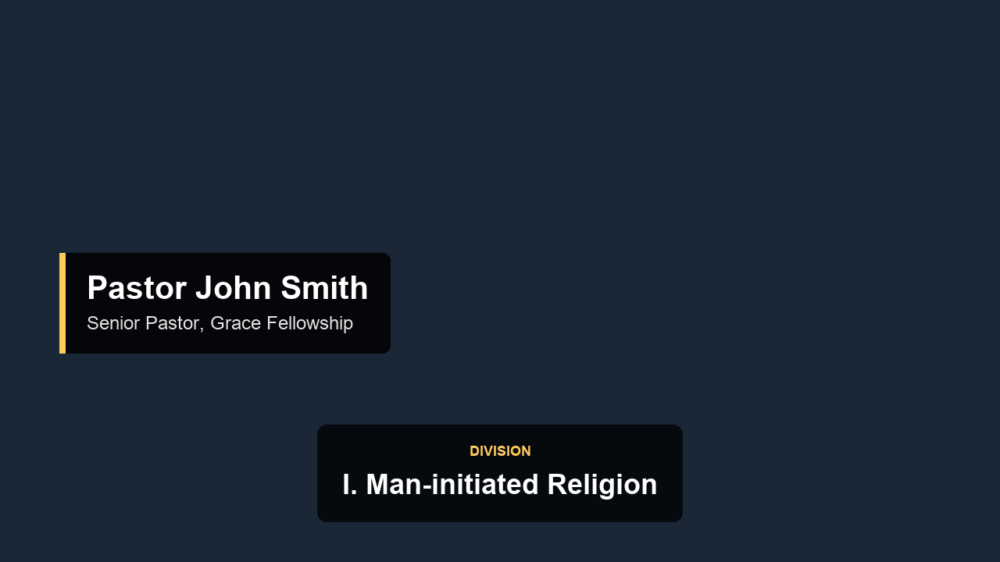

# 📖 Bible Study Video Editor

Turn a raw lesson recording into a finished teaching video. Upload the video,
paste in your outline, and the app works out **when** each point was actually
taught and burns it onto the footage as an on-screen caption — plus a lower
third with the speaker's name and title.



Everything it uses is free: the speech recognition runs on your own computer,
and the AI matching runs on a free API tier.

---

## What it does

| Step | What happens | Tool |
|------|--------------|------|
| 1 | Pulls the audio out of the video and transcribes it with timestamps | faster-whisper (local) or Groq Whisper (hosted) |
| 2 | Works out when each point's slide should appear **and disappear** | Google Gemini or Groq Llama |
| 3 | **Checks every placement** against the transcript before it is trusted | `verifier.py`, offline |
| 4 | Draws the point cards, the lower third and the bookends, and encodes a new MP4 | FFmpeg (MoviePy fallback) |

Then you get a review table: every point, when it was placed, whether it
passed the checks, and the words the speaker actually said there. Nudge
anything in the wrong place, untick anything you don't want, then render.

### How placements are checked

An LLM will happily return a confident, well-formatted timestamp that is
simply wrong — and a wrong timestamp is worse than none, because it puts a
caption on screen while the speaker is discussing something else. So nothing
reaches the video on the AI's word alone. Five independent checks run on every
point:

1. **Range** — the time exists inside this recording.
2. **Snapping** — the time is moved onto a real transcript line, so captions
   start with a sentence instead of cutting into the middle of one.
3. **Evidence** — the AI must quote the words it heard, verbatim, and that
   quote must actually be spoken at that moment. This is the strongest
   hallucination detector available: an invented quote scores near zero, and a
   real quote from the wrong part of the video scores exactly zero.
4. **Meaning** — an offline word-overlap score between your outline point and
   what is really being said there. It never talks to the AI, so it cannot
   agree with the AI's mistake.
5. **Second opinion** — the whole job is optionally run again on a *different*
   model. Where two models that never saw each other's answer agree, the
   placement is about as reliable as it gets without a human.
6. **Time on screen** — a card too brief to read, or one so long it has
   clearly swallowed the commentary after the point, is flagged.

Two more checks run across the whole set: divisions that appear out of their
written order, and several points landing on the same second.

Every point ends up marked **✅ verified**, **⚠️ worth a look**, or
**⛔ not found** — with the reason spelled out. Anything that fails is
**switched off by default**, so a bad placement cannot reach your video
through inattention.

### When things break

Models get retired, rate limited and overloaded without warning — during
development `gemini-2.5-flash` returned 404 (retired), `gemini-3.7-flash`
returned 503 (overloaded) and `gemini-pro-latest` returned 429 (quota), all on
the same afternoon. So the app never depends on one model:

* **Model chain** — `auto` tries the best model, then falls to the next when
  one is unavailable.
* **Retries** — up to three attempts per model with growing gaps, on the
  errors that are worth retrying.
* **Bad key detected immediately** — no point trying four models with a key
  that has already been rejected.
* **Schema-enforced JSON** — the reply shape is enforced by the API, not
  requested politely. Unparseable answers get one repair attempt.
* **Short answers are caught** — a reply that covers only some of the outline
  is retried rather than quietly letting the rest drop to the offline matcher.
  These models think before answering and thinking spends the same output
  budget, so a cut-off list can still be valid JSON.
* **Always an answer** — if every model is down, the offline keyword matcher
  takes over and says so. The app never fails with nothing to show.

### Transcript safety

Speech recognition output is untrusted text: it contains whatever was said in
the room, whatever a video played during the lesson said, and whatever the
speech model hallucinated over silence. So the transcript is fenced off inside
the prompt, delimiter sequences appearing inside it are neutralised, control
characters are stripped, and the model is told plainly that transcript content
is data to be searched and never instructions to follow.

The transcript is also audited before use, which catches the three failure
modes that otherwise produce confident nonsense: nothing was transcribed, only
a fraction of the recording contained speech, or the speech model looped on one
phrase over a long silence.

---

## When each slide appears and disappears

Every graphic gets its own start and end, worked out from how the lesson was
actually taught rather than from a fixed timer.

**The lower third** is not detected at all — it is fixed by the template at
**3.0s to 28.0s**.

**Takeaways, divisions and principles**

*Start* — the verbal cue that introduces the point: "that brings us to our
first principle", "our takeaway today is", "division two is". If the speaker
gives no cue, the slide starts where they begin reading the point's own words.

*End* — teachers repeat a point two or three times before they explain it.
Every repetition is tracked, and the slide comes down when the **last** one
finishes, just as the speaker turns to commentary, a story or an example. The
slide does not sit there over the explanation.

**Applications and reflection pauses**

*Start* — the introduction to the question, or the reading of it.

*End* — depends on whether the group is given time to think:

* A pause of **15 seconds or more** right after the question is reflection
  time. `has_timer` is set true, `timer_duration` is its measured length, and
  the slide stays up until speech resumes.
* No such pause and `has_timer` is false, with the slide coming down 2 seconds
  after the question finishes.

> A language model reads words; it cannot hear a pause. Silences are measured
> from the audio with FFmpeg and handed to the model as facts. Where the model
> and the audio disagree about a pause, **the audio wins** and the correction
> is recorded in the notes.

### The timeline it produces

```json
[
  {
    "type": "lower_third",
    "speaker_name": "RANEIL ENSOMO",
    "speaker_title": "NY MEN'S BIBLE STUDY FELLOWSHIP TEACHING LEADER",
    "start_time": 3.0,
    "end_time": 28.0
  },
  {
    "type": "principle",
    "header": "Principle #1",
    "content": "Religion is deceptively tempting, but neither saves nor satisfies.",
    "start_time": 597.0,
    "end_time": 612.0
  },
  {
    "type": "application",
    "header": "Application",
    "content": "Where in your life have you substituted activity for intimacy with God?",
    "start_time": 624.0,
    "end_time": 658.0,
    "has_timer": true,
    "timer_duration": 30
  }
]
```

From code:

```python
from matcher import build_lesson_points, match_lesson_points, elements_to_json
from transcriber import detect_silences

silences = detect_silences("lesson.mp4")
elements, notes, model = match_lesson_points(
    points, segments, api_key="…", duration=3600, silences=silences,
    speaker="Raneil Ensomo", speaker_title="Teaching Leader",
)
print(elements_to_json(elements))
```

## The transcript

`transcriber.py` has two entry points.

```python
from transcriber import extract_audio, transcribe_video, format_transcript

# 1. Audio out of the video, downmixed to the 16 kHz mono Whisper wants.
extract_audio("lesson.mp4")                     # -> "temp_audio.wav"
extract_audio("lesson.mp4", "/tmp/lesson.wav")  # -> "/tmp/lesson.wav"

# 2. Transcribe. Accepts an audio file or a video (audio is extracted and
#    cleaned up for you).
segments = transcribe_video("temp_audio.wav", "base")
```

`transcribe_video` returns a list of dictionaries in video order:

```python
[{"start": 12.5, "end": 18.2, "text": "Good morning, and welcome."}, ...]
```

Word timestamps are on by default, so each segment also carries a `"words"`
list of per-word timings. Pass `word_timestamps=False` to skip them.

> These really are dictionaries — `isinstance(segment, dict)` is True and they
> serialise straight to JSON. They also allow `segment.start` alongside
> `segment["start"]`, which is how the rest of the app reads them.

`format_transcript(segments)` renders the version handed to the language
model:

```
[00:00.000 -> 00:06.240] Good morning, and welcome.
[00:06.240 -> 00:14.100] Please open with me to Genesis chapter four.
```

The model is told to convert those back to plain seconds when it answers, and
the returned time is checked against the transcript before it is used.

## The visual template

**Lower third** — plain white text in the bottom left, nothing behind it.
Line 1 is the name in bold caps, line 2 the title in regular caps, smaller.
It cuts in hard at **00:03**, holds until **00:28**, and cuts out hard.

If a point card happens to be on screen at the same time, the card covers it —
white text on the beige card would be unreadable.

> White text with no box disappears against a bright wall or a window, so a
> faint dark halo is drawn behind the letters. It is invisible on dark footage.
> To remove it entirely, pass `lower_third_shadow=False` to `render_video`.

**Point cards** — each point fills the whole frame: beige `#DFDAD1`
background, black sans-serif text, header near the top, body centred. A
**120 × 120 px square in the top right is reserved for a logo**; supply one in
the sidebar and it is placed there, otherwise the space is simply left empty.

The header numbers itself: a lone point of a category reads `Takeaway`, while
several read `Principle #1`, `Principle #2`.

The card covers the picture, but **the audio keeps running underneath** — the
teaching continues while the point is on screen and the video does not get
any longer. If you would rather keep the picture visible, switch *Point style*
to *Caption over the video*.

**Lists** — put several items on one card by separating them with ` | `:

```
I. Man-initiated Religion | II. God-initiated Worship | III. The Response of Faith
```

A body with two or more numbered or lettered items is set left-aligned so the
numerals stack in a column, with the block as a whole centred.

**Intro and outro** — an opening and closing image, each held for 5 seconds
(adjustable), scaled to the frame without distortion and padded with silence
so the audio stays in step. These *do* make the finished video longer.

Put the artwork in the `assets/` folder once and it is used automatically
every session:

```
assets/intro.png     the series title slide
assets/outro.png     the closing slide
assets/logo.png      the mark for the top right of every point card
```

Anything uploaded in the sidebar overrides the folder. Make the intro and
outro the same shape as the video (16:9 for a normal widescreen recording) so
they fill the frame rather than being letterboxed.

From code:

```python
from moviepy import VideoFileClip
from editor import add_bookends

clip = add_bookends(VideoFileClip("lesson.mp4"), "intro.png", "outro.png")
```

**Countdown timer** — when a reflection pause is detected, a clean `MM:SS`
countdown appears under the application question and runs for the length of
the silence. The question text lifts to make room for it. The countdown is
built the same way as everything else, one Pillow-drawn frame per second, so
it costs almost nothing to render: a 30-second countdown added 1.3 seconds to
a full render.

The **Timer** column in the review table controls it. It is ticked
automatically when a long enough pause was measured; untick it to hide the
countdown, or tick it by hand and the card's own length is used.

**Cuts** — graphics cut hard in and hard out, matching the reference style.
Tick *Soften the cuts* for a quarter-second dissolve instead.

**Template metrics** — the lower third is inset 50 px from the left and
bottom, with the name at 52 pt and the title at 34 pt. Those figures are
quoted at 1080p and scaled proportionally, so a 720p or 4K master looks the
same rather than having a tiny or gigantic caption.

## Install and run

You need **Python 3.10 – 3.12** (3.13 also works). Nothing else — FFmpeg comes
bundled with the Python packages.

### The easy way

* **Mac** — double-click `run.command`
* **Windows** — double-click `run.bat`

First launch builds a private Python environment and downloads the packages
(5–10 minutes, once). After that it opens in a few seconds at
<http://localhost:8501>.

> On a Mac, if you see *"cannot be opened because it is from an unidentified
> developer"*, right-click `run.command` → **Open** → **Open**. You only have to
> do this once.

### The manual way

**Mac / Linux**

```bash
python3 -m venv .venv
source .venv/bin/activate
pip install -r requirements.txt
streamlit run app.py
```

**Windows (PowerShell)**

```powershell
python -m venv .venv
.venv\Scripts\Activate.ps1
pip install -r requirements.txt
streamlit run app.py
```

### Docker

```bash
docker compose up --build
```

Then open <http://localhost:8501>.

---

## Getting a free API key

You need one key, for step 2. Either works:

* **Google Gemini** — <https://aistudio.google.com/apikey> · sign in with a
  Google account, click *Create API key*. Most generous free tier; this is the
  one to pick.
* **Groq** — <https://console.groq.com/keys> · also free, and the same key
  additionally unlocks the fast hosted transcription option.

Paste the key into the sidebar. To avoid pasting it every time, create
`.streamlit/secrets.toml`:

```toml
GEMINI_API_KEY = "your-key-here"
GROQ_API_KEY = "your-key-here"
```

**Without a key** the app still works — it falls back to an offline keyword
matcher. That handles points that reuse the speaker's own wording, but it will
misplace anything paraphrased, so expect to fix a few times in the review table.

---

## Do I need to install FFmpeg?

Normally no — `imageio-ffmpeg` installs a private copy automatically. If you
ever see *"FFmpeg was not found"*:

* **Mac** — `brew install ffmpeg`
* **Windows** — `winget install Gyan.FFmpeg` (then reopen the terminal)
* **Linux** — `sudo apt install ffmpeg`

---

## Using it

1. **The recording** — either upload it, or choose *Use a file already on this
   computer* and paste the full path. A full-length lesson is often several
   gigabytes; pointing at the file on disk skips the upload entirely and starts
   straight away. (In Finder: right-click the file, hold Option, choose
   *Copy … as Pathname*.)
2. **Speaker** — name and title. These appear at 00:05 for five seconds.
   Leave blank to skip the lower third.
3. **Outline** — one point per line in each box:

   ```
   Takeaway:     True worship begins with God's initiative, not ours.

   Divisions:    I. Man-initiated Religion
                 II. God-initiated Worship
                 III. The Response of Faith

   Principles:   God defines how He is to be approached.
                 Obedience precedes blessing.

   Applications: Examine what you bring to worship this week.
   ```

   Write them the way you'd say them, not in note form — the AI matches on
   meaning, and a full sentence gives it more to work with.
4. **Analyse recording.** Measured on an Apple silicon laptop: transcription
   runs at about 30× realtime, so a 60-minute lesson takes roughly 2 minutes.
   Matching adds 10–20 seconds, doubled if the second-model check is on.
5. **Check the timings** in the table, then **Render final video** and
   download the MP4.

### Sidebar settings worth knowing

| Setting | What to pick |
|---------|--------------|
| **Engine** | *On this computer* keeps the recording private and needs no key. *Hosted* is far quicker and is the right choice on a slow laptop or a web host. |
| **Accuracy vs speed** | `base` is the sweet spot. Move to `small` if the room is echoey or the audio is quiet — it is 2–3× slower but noticeably more accurate. |
| **Seconds on screen** | Only a fallback. Each point normally gets its own length, worked out from how long it was taught. |
| **Render speed vs file size** | `ultrafast` renders quickest and makes a bigger file. `medium` is roughly half the size and about twice as slow. |
| **Rendering engine** | Leave on Fast. It hands the whole composite to FFmpeg in one pass and copies the original audio through untouched — measured at 20× realtime on 1080p, against 1× for the MoviePy path. A 60-minute lesson renders in about 3 minutes instead of an hour. Switch to Compatible only if a particular file refuses to render. |
| **Point style** | *Full-screen cards* is the template. *Caption over the video* keeps the picture visible. |
| **Timer** (per row) | Ticked automatically when a reflection pause was measured. Untick to hide the countdown. |
| **Header** (per row) | The bold line at the top of the card. Edit freely — a scripture reference works as well as "Principle #1". |
| **Soften the cuts** | Off matches the reference (hard cuts). |
| **Model** | Leave on `auto` unless you want to pin one. |
| **Double-check with a second model** | Leave on. It is the difference between "the AI said so" and "two models agreed". Costs seconds. |

---

## Sharing it with other people

Full instructions are in [`deploy/DEPLOYING.md`](deploy/DEPLOYING.md). In short:

* **Hugging Face Space** — a public link anyone can open, no login. Rebuilds
  automatically whenever you push. Best for lessons up to about 30 minutes;
  one person renders at a time.
* **Local install** — clone the repo, double-click `run.command` (Mac) or
  `run.bat` (Windows). No upload, no size limit, uses that person's own
  processor. This is the one for full-length lessons.
* **Updating** — double-click `update.command` / `update.bat`. It pulls the
  latest version and refreshes packages without touching your API key or your
  artwork in `assets/`.
* **Docker** — for anyone who keeps hitting Python version trouble.

---

## The files

```
app.py            Streamlit interface and the main flow
transcriber.py    Step 1 — audio extraction and timestamped transcription
assets/           intro.png, outro.png and logo.png, picked up automatically
matcher.py        Step 2 — prompts, model failover, JSON parsing, offline fallback
verifier.py       Step 3 — the five verification layers and the verdicts
editor.py         Step 4 — the visual template, cue scheduling, MP4 encoding
requirements.txt  Everything the app needs
fonts/            Drop a .ttf here to change the caption typeface
docs/             Example still
deploy/           Hosting instructions and the Hugging Face Space header
```

Each module runs on its own, so you can script the pipeline without the UI:

```python
from transcriber import transcribe_video
from matcher import build_lesson_points, match_lesson_points
from editor import render_video, cues_from_matches

from verifier import verify_matches, VERIFIED

segments = transcribe_video("lesson.mp4", engine="local", model_size="base")
points = build_lesson_points({"Division": "I. Man-initiated Religion"})
matches, notes, model_used = match_lesson_points(points, segments, api_key="…")

verdicts = verify_matches(matches, points, segments, duration=3600)
trusted = [v.match for v in verdicts if v.verdict == VERIFIED]

render_video(
    "lesson.mp4", "final.mp4",
    speaker_name="Raneil Ensomo",
    speaker_title="NY Men's Bible Study Fellowship Teaching Leader",
    cues=cues_from_matches(trusted),
    card_style="fullscreen",          # or "caption"
    logo_path="logo.png",
    intro_image_path="intro.png",
    outro_image_path="outro.png",
)
```

---

## When something goes wrong

| What you see | What to do |
|--------------|------------|
| *"This video has no audio track"* | The file is video-only. Re-export it with sound. |
| Every point matched to roughly the same moment | The AI could not tell them apart. Write the outline points as fuller sentences, or fix the times in the table. |
| *"used the offline keyword matcher"* | No key, a wrong key, or no internet. Check the key in the sidebar. Expect to fix several times by hand in this mode. |
| *"The API key was rejected"* | The key is wrong or has been revoked. Get a fresh one at the link in the sidebar. |
| *"Every model was unavailable"* | The provider is having a bad day. Wait a few minutes, or switch provider in the sidebar. |
| Lots of ⚠️ or ⛔ rows | The outline is worded very differently from how it was taught, or the audio is hard to hear. Read the **Checks** column — it says which test failed. |
| *"N point(s) are too close to the end"* | Two points landed within a few seconds of the finish. Move them earlier in the table. |
| Cards look tiny or use an odd typeface | No system font was found. Drop a `.ttf` into `fonts/` — see `fonts/README.txt`. |
| The logo is cut off | It is fitted into a 100 × 100 px square. Use a square image, ideally a PNG with a transparent background. |
| The intro or outro looks letterboxed | The image is a different shape from the video, so it is fitted whole onto a black field rather than cropped. Match the video's aspect ratio to fill the frame. |
| Rendering is very slow | Make sure the rendering engine is on **Fast**, not Compatible. |
| Out of memory on a web host | The free tier is too small for that video. Run it locally, or trim the recording first. |

---

## Keeping the API key safe

The key lives in `.streamlit/secrets.toml`, which is listed in `.gitignore` and
must never be committed or copied into a shared deployment. If a key has been
pasted into a chat, an email or a shared document, treat it as public: revoke
it at <https://aistudio.google.com/apikey> and issue a new one. On a hosted
deployment, put the key in the host's own secrets panel instead of in a file.

## Notes on privacy

With the *on this computer* engine, the recording never leaves the machine —
only the **text** of the transcript is sent to the AI provider for matching.
With the *hosted* engine, the audio is uploaded to Groq as well. If a lesson is
sensitive, use the local engine, or skip the API key entirely and place the
captions by hand in the review table.
